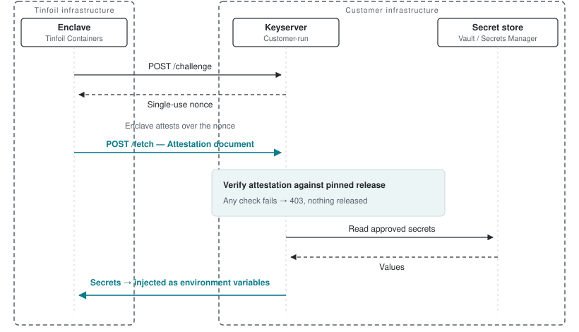

# Tinfoil Keyserver

Run your own keyserver and your Tinfoil Containers get secrets that Tinfoil
never sees. The keyserver sits in front of your secret store (HashiCorp Vault,
AWS Secrets Manager, or a local file for isolated deployments) and releases a
secret only to an enclave that proves it is running the exact release you
pinned.

## Quickstart

### 1. Run the keyserver

Needs a public TLS certificate on a real domain and your policy.

```bash
docker run -p 8443:8443 \
  -v $PWD/policy.yaml:/policy.yaml -v $PWD/tls:/tls \
  -e BACKEND=vault -e VAULT_ADDR=... -e VAULT_TOKEN=... -e VAULT_PREFIX=tinfoil \
  ghcr.io/tinfoilsh/keyserver -policy /policy.yaml -tls-cert /tls/cert.pem -tls-key /tls/key.pem
```

### 2. Write your policy

`policy.yaml` pins which build may receive which secrets: your workload repo,
a release tag, and the domain your deployment is served at. The enclave's
attestation document is authenticated against that repo's Sigstore signing
identity — the same verification Tinfoil SDK clients do — and its release tag
must equal the pin. Bump the tag to authorize a new release. See
`policy.example.yaml`.

```yaml
workloads:
  hello-world:
    repo: org/hello-world
    tag: v1.0.0
    domain: hello-world.example.com  # only an enclave serving this domain qualifies
    secrets:
      DEMO_SECRET: {path: workloads/hello-world/demo, field: value}
```

`domain` is required. Config repos are public, so anyone can deploy your exact
repo and tag and produce an identical, validly attested enclave; the domain pin
is what makes the secrets yours. The caller must present a certificate a public
CA issued for that domain, which only your deployment holds.

Launch with `debug: false` — debug-enabled enclaves are rejected.

### 3. Store the secret

The keyserver supports HashiCorp Vault, AWS Secrets Manager, and a local file
as secret backends. Choose one with `BACKEND` and store each policy entry in
that backend using its configured path and field.

**HashiCorp Vault** (`BACKEND=vault`) — reads KV v2 at
`VAULT_KV_MOUNT/VAULT_PREFIX/<path>`, key `<field>`, with a read-only token:

```bash
vault policy write tinfoil-keyserver - <<'EOF'
path "secret/data/tinfoil/*" { capabilities = ["read"] }
EOF
vault token create -policy=tinfoil-keyserver -period=768h
vault kv put -mount=secret tinfoil/workloads/hello-world/demo value=hunter2
```

**AWS Secrets Manager** (`BACKEND=aws`) — `<path>` is the secret name under
`AWS_SECRETS_PREFIX`, `<field>` a key in its JSON value. Credentials via the
usual chain (IAM role, env keys, or profile) plus `AWS_REGION`:

```bash
aws secretsmanager create-secret \
  --name tinfoil/workloads/hello-world/demo \
  --secret-string '{"value": "hunter2"}'
```

Grant the keyserver only `secretsmanager:GetSecretValue` on
`arn:aws:secretsmanager:<region>:<account>:secret:tinfoil/*`.

**Local file** (`BACKEND=file`) — intended for examples and isolated
deployments. `FILE_SECRETS_PATH` names a mode-`0600` JSON file loaded once at
startup, with policy paths and fields represented directly:

```json
{"workloads/hello-world/demo":{"value":"hunter2"}}
```

### 4. Wire your deployment

In your measured `tinfoil-config.yml`:

```yaml
keyserver-url: https://keys.example.com
containers:
  - name: app
    image: ghcr.io/org/app@sha256:...
    secrets: [DEMO_SECRET]
```

At boot the enclave fetches `DEMO_SECRET` and injects it as an env var —
fail-closed, so it never starts with the variable missing. Enclaves fetch at
every boot; keep the keyserver reachable, serve `/challenge` and `/fetch`
directly at `keyserver-url` (the enclave refuses redirects).

## How release is decided

<picture>
  <source media="(prefers-color-scheme: dark)" srcset="docs/protocol-dark.svg">
  
</picture>

Every request must pass all of these, or nothing is released:

- The nonce was issued by this keyserver, is unexpired, and is used once —
  the attestation document is provably fresh.
- The document verifies **offline** via the [Tinfoil SDK](https://github.com/tinfoilsh/tinfoil-go):
  the quote chains to the AMD/Intel roots (debug rejected), and the embedded
  Sigstore artifacts authenticate it as a release of the pinned repo — the
  authenticated tag must equal the pinned tag.
- The caller's TLS key matches the key endorsed inside the document, so a
  captured or relayed attestation is useless.
- The caller's certificate must be CA-issued for the pinned `domain` —
  someone else deploying the same public repo cannot qualify.

`/challenge` itself is intentionally unauthenticated: a nonce grants no
authority. The keyserver requires the client certificate at `/fetch`, where it
binds the verified attestation to the channel carrying the secret response.
